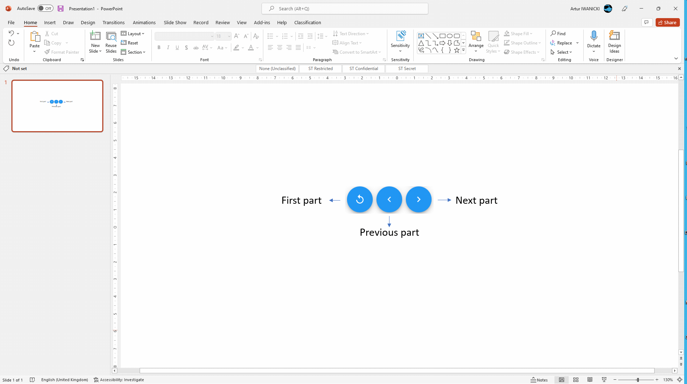
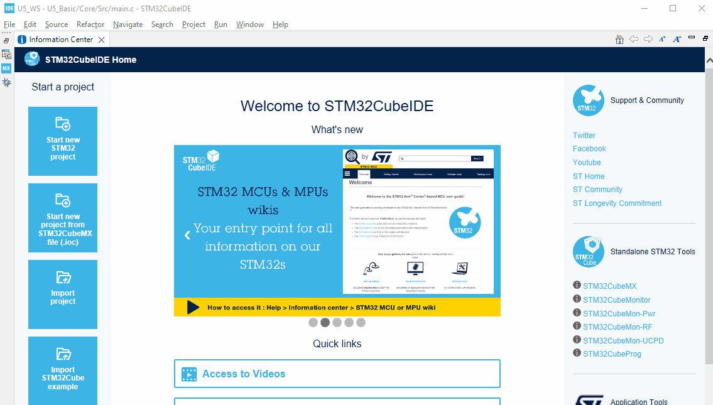
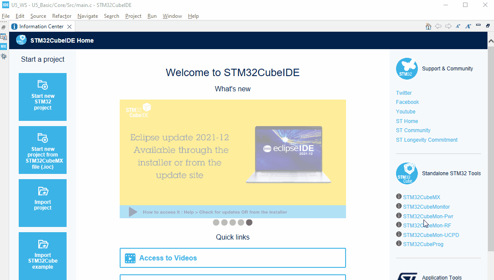
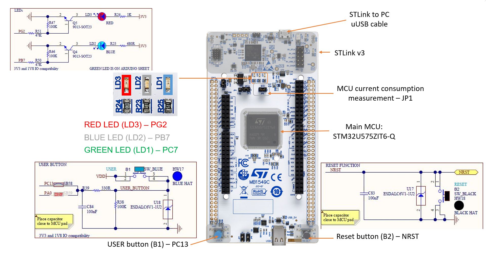
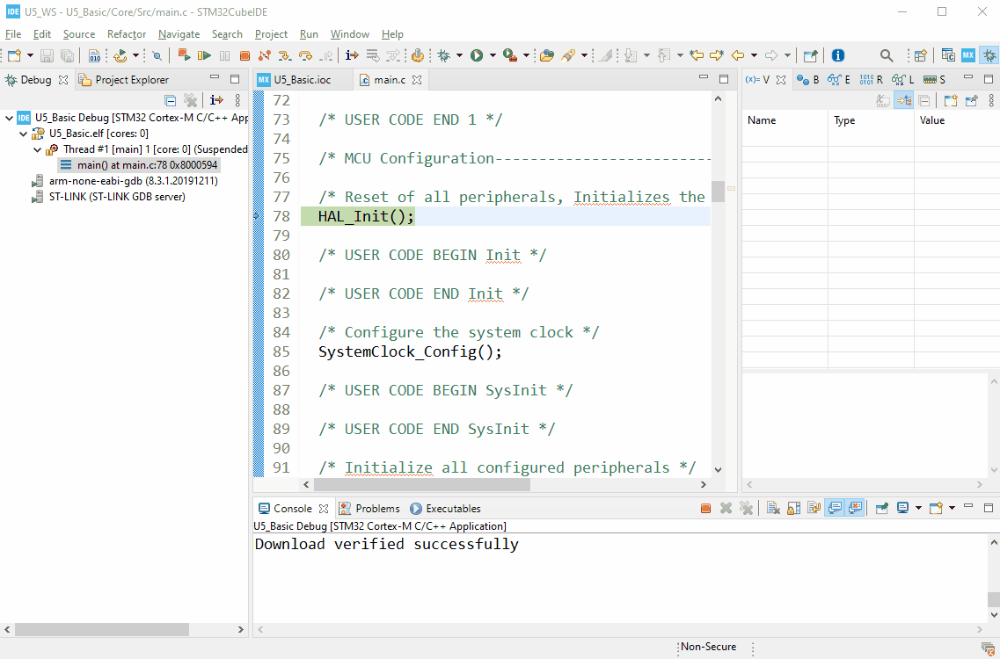

----!
Presentation
----!

# Introduction
## Dear Participant of STM32U5 Workshop,
 

 Welcome to this short step-by-step guide which could help you to prepare to live version of STM32U5 Workshop session.

 You will find here:
 - all information about prerequisites (software and hardware), 
 - short information about installation process, 
 - links to materials useful for this session

Additionally, in appendixes you can find some basic information about the board we will use durig the session and useful information about configuraiton and usage of STM32cubeIDE built in terminal
 

To navigate within this manual, please use navigation buttons:
 

  

 

In case of any questions / problems please contact us on [link](community.st.com)

See you on STM32U5 Workshop live session
 

## Yours, 
## STMicroelectronics 
 

# Prerequisites
- Hardware:
  - **PC with MS Windows 10 operating system**
  - **2 micro USB** cables
  - **2 female-female wires** (min 10cm length) to connect gold pins 
  - **[NUCLEO-U575ZI-Q](https://www.st.com/en/evaluation-tools/nucleo-u575zi-q.html)** board (will be delivered on the session)
  - **[STM32L562E-DK](https://www.st.com/en/evaluation-tools/stm32l562e-dk.html)** board (will be delivered on the session)
- Software (PC with **MS Windows 10** operating system):
  - **[STM32CubeIDE](https://www.st.com/en/development-tools/stm32cubeide.html)** in version 1.9.0
    - **[STM32U5 Cube library](https://www.st.com/en/embedded-software/stm32cubeu5.html)** in version 1.1.0
  - **[STM32Cube Monitor Power](https://www.st.com/en/development-tools/stm32cubemonpwr.html)** in version 1.1.1
  - `[optionally]` any **terminal** application (can be used the one from STM32CubeIDE)
 
# Materials for the session
- slides
- solutions of the projects
- documentation
   

# Installation process
- download **STM32CubeIDE** from [here](https://www.st.com/en/development-tools/stm32cubeide.html)
- Install **STM32CubeIDE** (if not yet done)
- download and install **STM32U5 Cube library** (if not done yet):
  - run **STM32CubeIDE**
  - go to `Help -> Manage Embedded Software Packages`
  - within package manager window find `STM32U5`, unroll it and select newest available version
  - press `install now`
 

 
In case of library installation problems please try an alternative way:
 - download **STM32U5 Cube library** (.zip file)
 - run **STM32CubeIDE**
 - go to `Help -> Manage Embedded Software Packages`
 - within packager manager window use option `From local` 
   

 
- download and install **STM32CubeMonitor-Power** (if not yet done) from [here](https://www.st.com/en/development-tools/stm32cubemonpwr.html):
 
In case you would like to know more about this tool and its usage you can have a look at dedicated video.
 

----

<ainfo>
## **Congratulations** You have completed installation part. Now you are fully prepared for the live workshop session. 
</ainfo>

----

# **Appendix A** - Board overview
  
**NUCLEO-U575ZI-Q** board
[schematics](https://www.st.com/resource/en/schematic_pack/mb1549-u575ziq-c03_schematic.pdf)

 

----

 
# **Appendix B** - configuration and start **STM32CubeIDE** built-in terminal  
 
### You can follow dedicated video on this topic [here from 8:50](https://www.youtube.com/watch?v=JWOV4j5fCS4&list=PLnMKNibPkDnFCosVVv98U5dCulE6T3Iy8&index=11&t=569s)

- Being in the debug session (debug perspective), please go to Console window (bottom part of the screen) 
- select `New -> 3 Command Shell Console` 
- specify `Connection Type` to **Serial Port**
- select **New** within `Connection name` (in case of previously configured connections you can select them from the list)
- in case of new connection, select its name (i.e. `Internal_Term`)
- select port number (used by STLink Virtual COM port - usually highest from the list)
- adapt communication parameters if needed (in our case default settings are inline with application ones)
- to confirm press `Finish`
- press `OK` on the next window
- After proper configuration, Console will contain terminal window (already connected)
- It is possible to disconnect the terminal, connect it or close it
   
  

