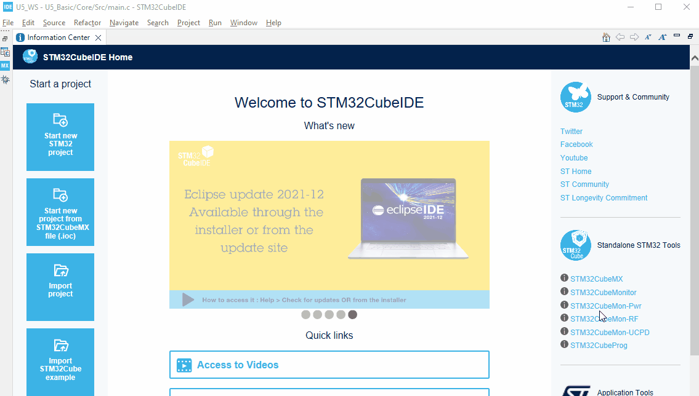
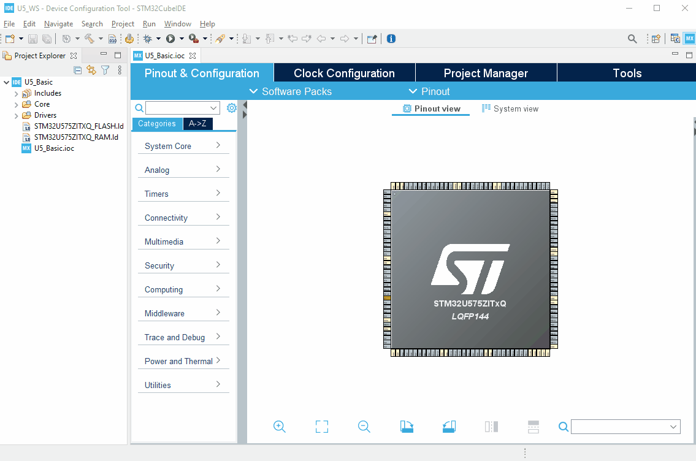
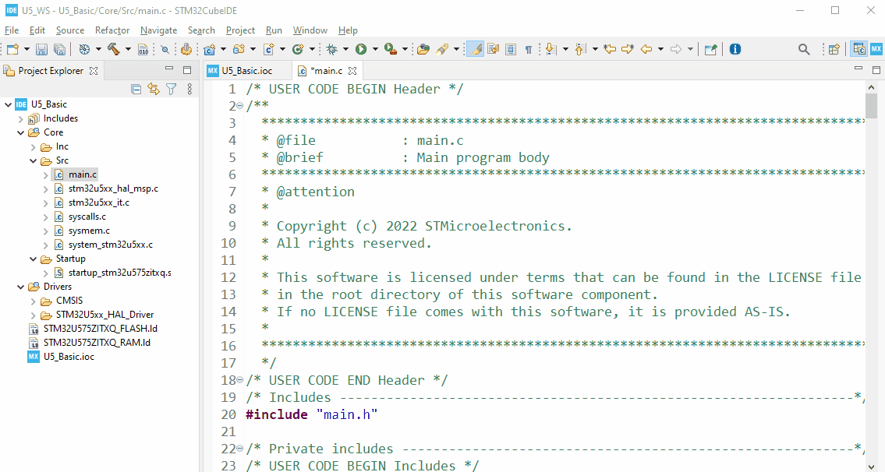
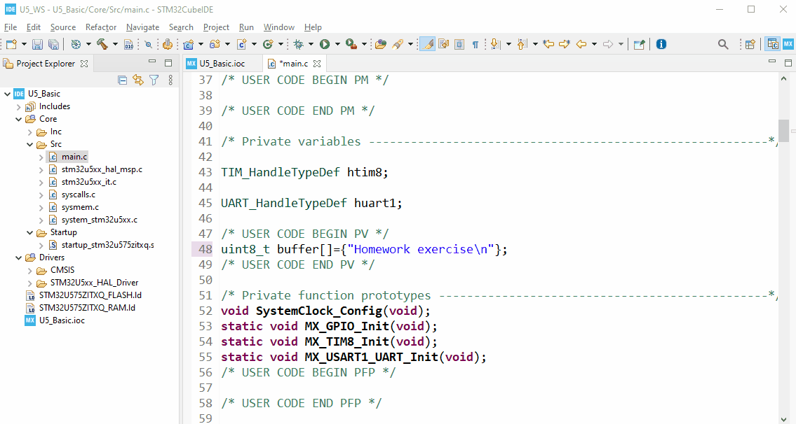
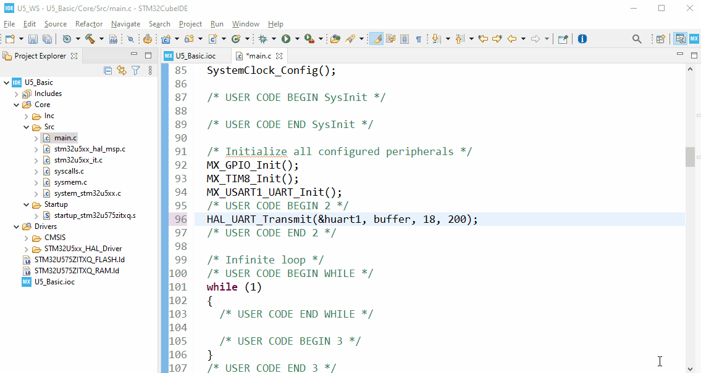
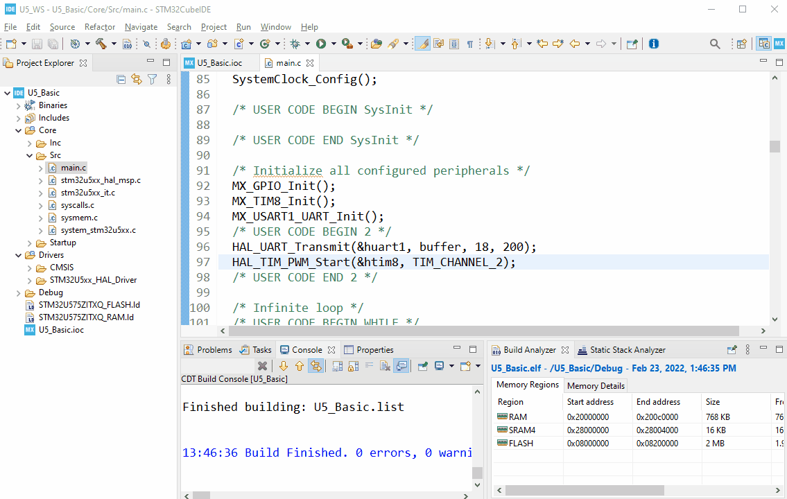

----!
Presentation
----!
# Introduction

Dear Participant of STM32U5 on-line Workshop,

Welcome to this short step-by-step guide which could help you to prepare to on-line version of STM32U5 Workshop session.
<br>
You will find here;
- all information about prerequisites (software and hardware), 
- short information about installation process, 
- links to materials useful for this session
- step by step guide on simple exercise on NUCLEO-L575ZI-Q board using STM32CubeIDE toolchain which could help you to verify your installation process

In case of any questions / problems please contact us on [link](community.st.com)

Yours, 
STMicroelectronics 

# Prerequisites
- Hardware:
  - **PC with MS Windows 10 operating system**
  - **2 micro USB** cables
  - **2 female-female wires** (min 10cm length) to connect gold pins 
  - **NUCLEO-U575ZI-Q** board 
  - **STM32L562E-DK** board 
- Software (PC with **MS Windows 10** operating system):
  - **STM32CubeIDE** in version 1.9.0
  - **STM32U5 Cube library** in version 1.1.0
  - **STM32Cube Monitor Power** in version 1.1.1
  - `[optionally]` any **terminal** application (can be used the one from STM32CubeIDE)

----

# Materials for the session
- slides
- solutions of the projects
- documentation
  
----

# Installation process
- download **STM32CubeIDE** from [here](https://www.st.com/en/development-tools/stm32cubeide.html)
- Install **STM32CubeIDE** (if not yet done)
- download and install **STM32U5 Cube library** (if not done yet):
  - run **STM32CubeIDE**
  - go to `Help -> Manage Embedded Software Packages`
  - within package manager window find `STM32U5`, unroll it and select newest available version
  - press `install now`


In case of library installation problems please try an alternative way:

 - download **STM32U5 Cube library** (.zip file)
 - run **STM32CubeIDE**
 - go to `Help -> Manage Embedded Software Packages`
 - within packager manager window use option `From local` 
  


- download and install **STM32CubeMonitor-Power** (if not yet done) from [here](https://www.st.com/en/development-tools/stm32cubemonpwr.html):

In case you would like to know more about this tool and its usage you can have a look at dedicated video.


----


# Board overview
 
**NUCLEO-U575ZI-Q** board
[schematics](https://www.st.com/resource/en/schematic_pack/mb1549-u575ziq-c03_schematic.pdf)


----

# **STM32CubeIDE** - basic project creation
## **Application description**
 - send some data over USART1 (to be monitored by terminal application)
 - control Green LED by channel2 of Timer8 (1 second period blinks)

----

## **Task definition**
- Using STM32CubeIDE:
 - Configure system clock (SYSCLK and HCLK) to 4MHz using internal MSI oscillators (default settings)
 - Configure USART1:
   - in asynchronous mode, 
   - using default settings (115200bps, 8D, 1stop bit, no parity) 
   - on PA9/PA10 pins
 - Configure Timer8:
   - in master mode (default), 
   - supplied by internal clock, 
   - with PWM generation on channel2 (PC7 - green LED (LD1) connection), 
   - 2 seconds period (combination of prescaler and autoreload value), 
   - 50% duty cycle (pulse settings for channel2)

----

## **Step1** - project creation and peripherals configuration
 - Run **STM32CubeIDE**
 - Specify workspace location (i.e. `C:\_Work\U5_WS`)


- Start new project using one of the below methods:
  - by selecting `File->New->STM32Project` 
  - by click on `Start new STM32 project` button
  

  

- select STM32**U575ZI**TxQ MCU
- press `Next` button
- within STM32 Project window:
  - specify project name (i.e. `U5_Basic`)
  - select option **without TrustZone**
  - press `Finish` button
  - on warning pop-up window press `Yes` button
  
   

- within **Clock Configuration** tab:
  - keep the default settings (4MHz based on MSI)

  

- Peripherals configuration: Pinout&Configuration tab
- **USART1 configuration** (Connectivity group)
  - select Asynchronous mode
  - keep default settings in configuration:
    - Basic parameters: 115200bps, 8bits data, 1 stop bit, no parity
    - Pins assignment: PA9, PA10
    - no interrupts, no DMA usage
  
    

- **Timer8 configuration** (Timers group)
  - Clock Source: internal clock
  - Channel2: PWM Generation CH2 (on PC7 pin). In case of different pin assignment, press Ctrl and left button on mouse over this pin, then drag the pin on the highlighted PC7 location and relase mouse button and then Ctrl key
  - Parameters Settings:
    - Prescaler and Counter Period to have 2s period (i.e. 3999, 1999)
    - Pulse to have 50% duty cycle (i.e. 1000)
  
 

- **Project settings**
  - select `Project Manager` tab
  - check project location (.ioc file)
  - check project name

   

  - generate project by one of the ways:
    - by pressing "gear" icon
    - by select `Project->Generate Code`
    - by pressing **Alt+K**
  - we will not use ICACHE in this example, thus press `Yes` on `Warning Code Generation` pop-up window

  

----

## **Step2** - coding part (`main.c` file)


Define the buffer of bytes to be sent over **USART1** (`USER CODE PV` section):

```c
/* USER CODE BEGIN PV */
uint8_t buffer[]={"Homework exercise\n"};
```



Start transmit of the data over **USART1** using prepared buffer and ***polling*** method (`USER CODE 2` section):

```c
/* USER CODE 2 BEGIN */
HAL_UART_Transmit(&huart1, buffer, 18, 200);
```



Start **Timer8** in PWM mode on its ***Channel2*** according to its configuration (the same section as above):

```c
HAL_TIM_PWM_Start(&htim8, TIM_CHANNEL_2);
```



----

## **Step 3** - build the project, run the application
- Build the project using `hammer` button or `Project->Built All` or **Ctrl+B**


- Connect board to PC using micro-USB cable


 - Start the debug session using `bug` icon or `Run->debug` or by pressing **F11**
 - All the settings should be automatically set based on your compiled project. Press `OK` button
 - Select `Switch` within `Configure Perspective Switch` dialog which is informing about new (debug one) windows setup within STM32CubeIDE application.



 - Start terminal application and run it for virtual COM port number assigned to the NUCLEO board with settings: 115200bps, 8bits data, 1 stop bit, no parity, no HW control. As an alternative you can use STM32CubeIDE built-in terminal (please have a look within Appendix for more details)
 - run the application within debug session. As a result Green LED should toogle each second and within terminal there should be "Homework exercise" message displayed.
  


----

<ainfo>
 **Congratulations** You have completed homework part. Now you are fully prepared for the online workshop session 
</ainfo>

----

# **Appendix** - configuration and start **STM32CubeIDE** built-in terminal 

## You can follow dedicated video on this topic [here from 8:50](https://www.youtube.com/watch?v=JWOV4j5fCS4&list=PLnMKNibPkDnFCosVVv98U5dCulE6T3Iy8&index=11&t=569s)

- Being in the debug session (debug perspective), please go to Console window (bottom part of the screen) 
- select `New -> 3 Command Shell Console` 
- specify `Connection Type` to **Serial Port**
- select **New** within `Connection name` (in case of previously configured connections you can select them from the list)
- in case of new connection, select its name (i.e. `Internal_Term`)
- select port number (used by STLink Virtual COM port - usually highest from the list)
- adapt communication parameters if needed (in our case default settings are inline with application ones)
- to confirm press `Finish`
- press `OK` on the next window
- After proper configuration, Console will contain terminal window (already connected)
- It is possible to disconnect the terminal, connect it or close it
  
  

